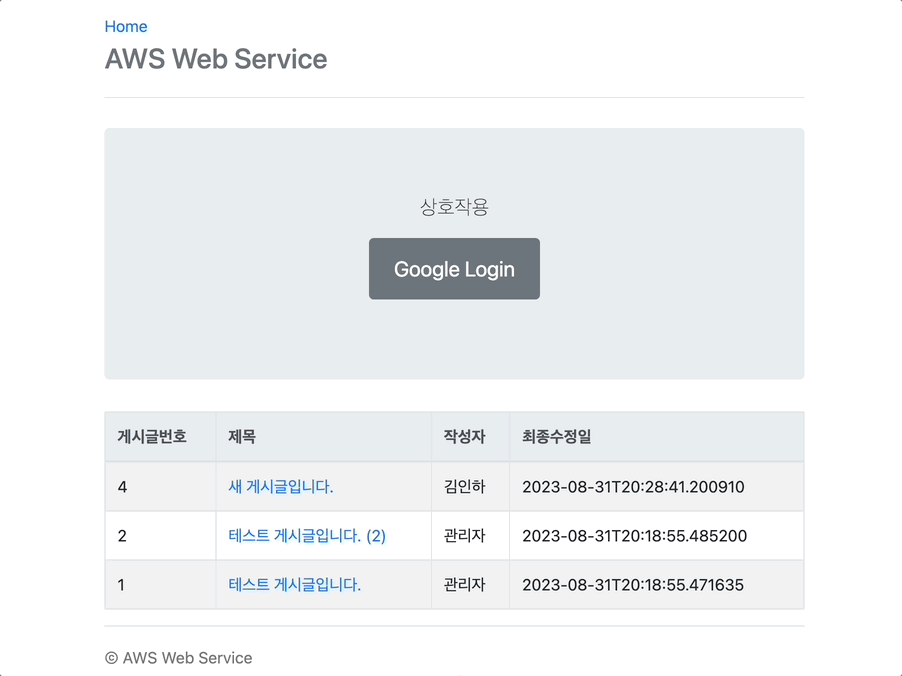
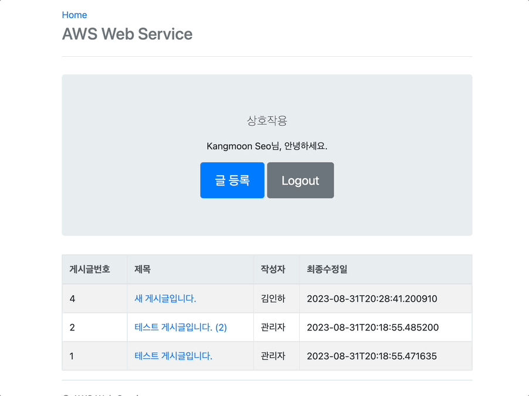
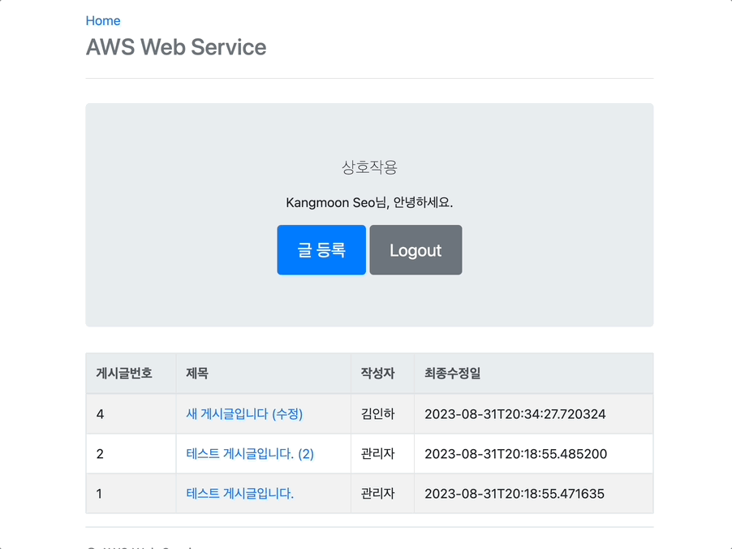

# aws-web-service

- SNS 계정 연동 기능을 사용한 게시판입니다. 
    - OAuth 2.0 사용
- AWS를 활용하여 배포를 준비 중입니다. 

## 기능

이미지 접기/펼치기

### 구글 연동 로그인

### 게시글 수정

## 게시글 삭제 및 로그아웃

### 참고자료

- 이동욱, "스프링 부트와 AWS로 혼자 구현하는 웹 서비스", 프리렉, 2019
- 김영한, 모든 개발자를 위한 HTTP 웹 기본 지식
- 김영한, 스프링 핵심 원리 - 기본편
- 김영한, 스프링 MVC 1편 - 백엔드 웹 핵심 개발 기술
- 김영한, 자바 ORM 표준 프로그래밍 - 기본편
- 김영한, 실전! 스프링 부트와 JPA 활용1 - 웹 애플리케이션 개발

<!-- 
    23.08.21. 
    ~
    23.08.27. 
-->